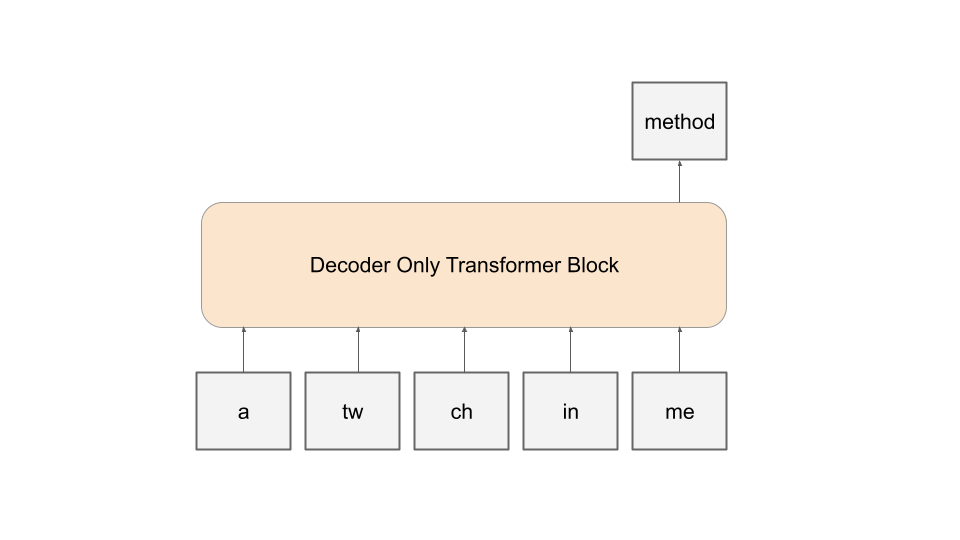
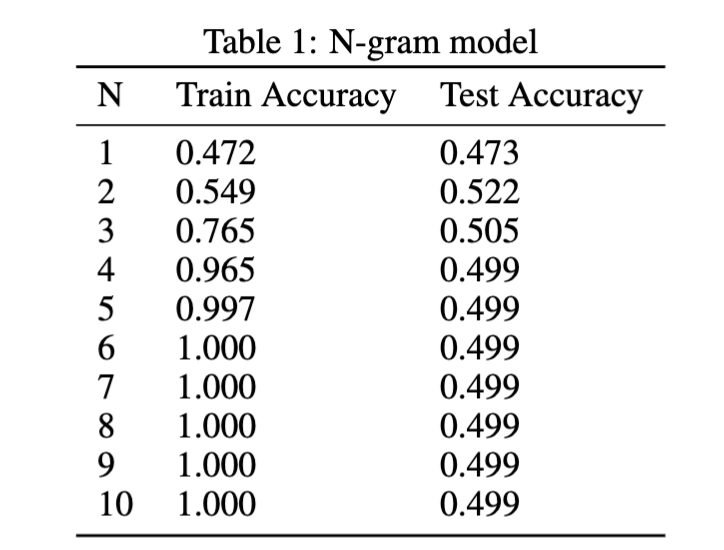
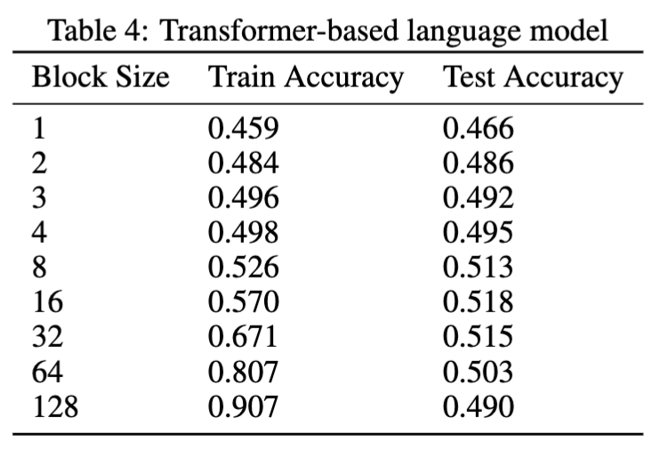

# input-method
Two characters input method using transformer-based language model and n-gram model.




## How to use


### N-gram model

- train and evaluate the n-gram model with shakespeare dataset
```bash
python3 src/input_method/train-ngram.py
```

### Transformer-based language model
- train the NanoLM model with shakespeare dataset
```bash
python3 src/input_method/train.py --data_name "shakespeare" --batch_size 128 --n_iteration
s 5000 --n_freq_eval 100 --dropout_rate 0.1 --learning_rate 0.001 --num_layers 8 --embed_size 256  --head_size 32 --num_heads 8 --block_size 4
size 1
```

- evaluate the NanoLM model with shakespeare dataset
```bash
python3 src/input_method/evaluate.py --data_name "shakespeare" --batch_size 4
```


## Features
- Two tokenizers are used
  - TwoCharTokenizer: vocab = {"a ", ..., "z ", "aa", ..., "zz"}
      - The vocab size is 26 + 26 * 26 = 702
  - WordTokenizer: vocab = {"a", ..., "word", ...}
    - The vocab size depends on the dataset
- Predict the corresponding word given the previous and current two characters (e.g., P("method" | ("a ", "tw", "ch", "in", "me"))) using the transformer-based language model

## Results

- N-gram model


- Transformer-based language model



## Reference
- https://github.com/speed1313/jax-llm